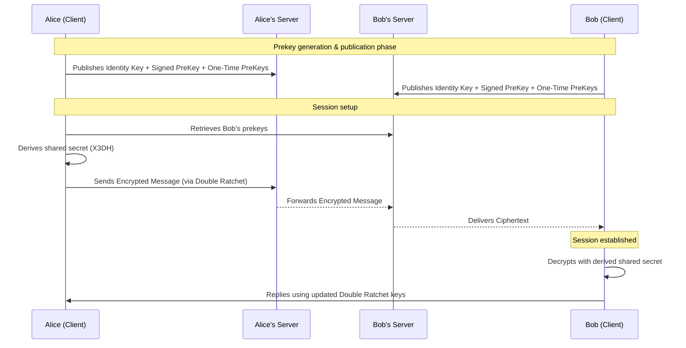

# 🕶️ HushNet  
### Silent. Secure. Sovereign.

---

## 🌐 Vision

**HushNet** is my attempt to rethink how private communication should work —  without intermediaries, analytics, or dependency on corporate servers.  

I’m building a communication layer where anyone can talk, share, and sync securely, while keeping full control over their infrastructure.  

---

## 💡 Principle

Traditional messaging apps rely on **centralized trust**:  
your messages go through someone else’s server — even if they’re encrypted.  
That’s still a single point of failure, of censorship, and of visibility.

HushNet takes the opposite approach:  
- The app handles **end-to-end encryption** natively.  
- The backend is **open-source** and **self-hostable**.  
- Anyone can connect to their own instance — or to a public node if they prefer.  

> No account lock-ins. No mandatory servers. No surveillance economy.  
> Just pure encrypted communication, wherever you choose to host it.

---
## 🔐 Encryption Model

HushNet uses a **modern E2EE architecture** inspired by the **Signal Double Ratchet** protocol.  
Each user’s device maintains its own key state and updates it after every message,  
ensuring *forward secrecy* and *post-compromise security*.

### 🧭 Flow Overview

---
## 🧩 How It Works

- The **HushNet App** (client) manages keys, sessions, and encrypted messages locally.  
- The **HushNet Server** (Rust backend) acts as a simple message relay — it never sees plaintext.  
- Each user (or organization) can **run their own server**, register devices, and federate with others.  
- The app lets you **select or configure your own node** at any time.  

This means:
- You can use the default HushNet node — or self-host your own in a few commands.  
- You can run it privately for your friends, company, or research network.  
- You can fork and extend the protocol freely.  

---

## 🧠 Philosophy

HushNet is built on three principles:

1. **Silence** — communication without noise, tracking, or exposure.  
2. **Resilience** — networks that survive censorship and compromise.  
3. **Transparency** — every component open to audit and improvement.

I don’t want users to depend on me — I want them to **depend on math**.  
Encryption replaces trust. Openness replaces authority.

---

## 🔐 Core Ideas

- **End-to-End Encryption by Default**  
- **Forward Secrecy** via the Double Ratchet protocol  
- **Multi-device support** with identity-linked prekeys  
- **Federation-Ready Design** — connect to your own node or others  
- **Zero Metadata Policy** — no message content, no analytics, no profiles  

> Privacy doesn’t require permission.  
> It requires architecture.

---

## ⚖️ License

Everything under **HushNet** is open source and free to use, study, or modify.  
Code is released under permissive licenses (MIT or Apache-2.0).  
Security should thrive in the open — not behind NDAs.

---

> _"The quietest networks are the hardest to break."_  
> — HushNet

